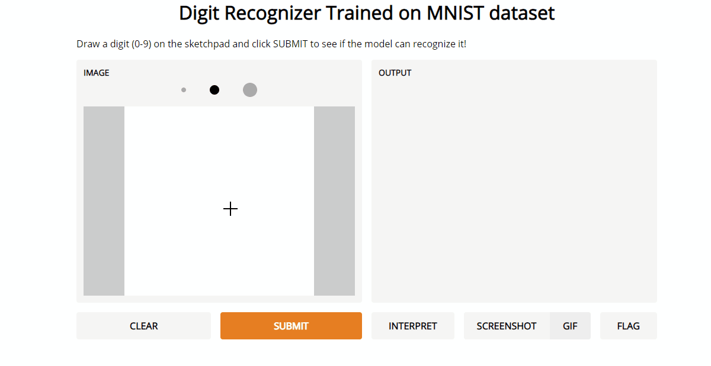

# MNIST Digit Recognizer
This digit recognizer was built for the [Kaggle Digit Recognizer Competition](https://www.kaggle.com/c/digit-recognizer). The goal was to train and test digit recognition models given 42,000 training images and 28,000 test images from the [MNIST Dataset](http://yann.lecun.com/exdb/mnist/). 

On my first attempt, I used Tensorflow and Keras to create a simple convolutional neural network with three blocks of convolution and max pooling followed by a series of 3 fully connected layers which achieved a 98.81% accuracy score on Kaggle. I tried to improve this score by playing around with the training parameters and the neural network architecure. I also tried using regularization techniques like early stopping and dropout layers to prevent overfitting. Over 11 iterations, the highest score I was able to achieve on the Kaggle test data was 98.87%. 

I also put together a quick interface for the model using Gradio.

